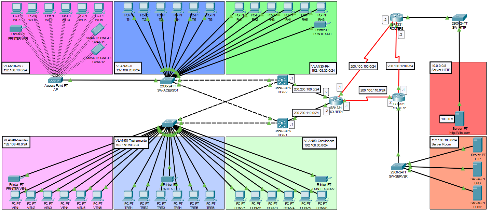

## Introdução ao Projeto.
Este projeto consiste na simulação de uma infraestrutura de rede corporativa, projetada para garantir segmentação, organização lógica e redundância de conectividade. A rede é estruturada com VLANs distintas para diferentes setores, otimizando o desempenho e a segurança da comunicação interna.

A infraestrutura conta com switches de Camada 2 e Camada 3, roteadores interligados e um conjunto de servidores essenciais, incluindo DNS, DHCP e HTTP. Além disso, mecanismos de redundância foram implementados para garantir disponibilidade e continuidade operacional em caso de falhas na rede.

## Infraestrutura.
A rede foi projetada para simular um ambiente corporativo robusto, utilizando o Cisco Packet Tracer como ferramenta de modelagem e configuração. A topologia implementa segmentação por VLANs (10, 20, 30, 40, 50, 60) para otimizar o tráfego e reforçar a segurança, enquanto switches de Camada 2 e Camada 3 garantem a conectividade interna e o roteamento entre redes.

Três roteadores interligam a infraestrutura, proporcionando redundância e continuidade operacional. Além disso, servidores DNS, DHCP e HTTP foram configurados para gerenciar atribuição dinâmica de endereços IP, resolução de nomes e hospedagem de aplicações web.

A configuração inclui protocolos de roteamento dinâmico e distribuição eficiente do tráfego, garantindo desempenho e disponibilidade para os usuários da rede.

> Abra a imagem e uma nova aba para exibir com melhor resolução.

## Segmentação de VLANs

VLAN 10 - WiFi
  Exclusiva para dispositivos sem fio, garantindo isolamento e melhor gerenciamento do tráfego. Todos os dispositivos conectados ao Access Point, como notebooks, smartphones e impressoras Wi-Fi, operam dentro desse segmento. A atribuição de endereços IP é gerenciada 
dinamicamente por um servidor DHCP.

VLAN 20 - TI
  Segmento exclusivo para o setor de Tecnologia da Informação, garantindo um ambiente isolado e seguro para administradores de rede e técnicos. A comunicação desta VLAN com redes externas é restrita, limitando acessos não autorizados e reforçando a segurança dos dispositivos críticos.
    
VLAN 30 - RH
  Destinada à segmentação de dispositivos específicos para o ambiente de Recursos Humanos, incluindo estações de trabalho (PCs) e impressoras, que atuam como endpoints dentro desta VLAN.
    
VLAN 40 - Vendas
  Esta VLAN é alocada ao setor de Vendas, seguindo a mesma estrutura da VLAN de Recursos Humanos. A VLAN 40 contém dispositivos como PCs e impressoras, que funcionam como endpoints para atender às necessidades específicas do setor.
    
VLAN 50 - Treinamento
  Dedicada ao processo de treinamento (Onboarding) de novos colaboradores. Nela, são disponibilizados os endpoints necessários para apoiar o desenvolvimento profissional dos funcionários.
    
VLAN 60 - Convidados
  Esta VLAN é dedicada ao tráfego de convidados, sendo isolada das demais VLANs da rede para prevenir possíveis ações indesejadas e garantir a segurança da infraestrutura.

## Switches de Acesso (Layer 2)

  Switch de Acesso 1 (SW-ACESSO1)
    Para configurar as portas FastEthernet 1 a 8 como membros da VLAN 10, foram executados os seguintes comandos:
>interface range fastEthernet 0/1-8
>
>switchport access vlan 10
